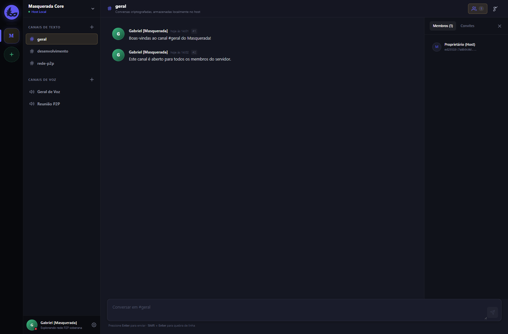
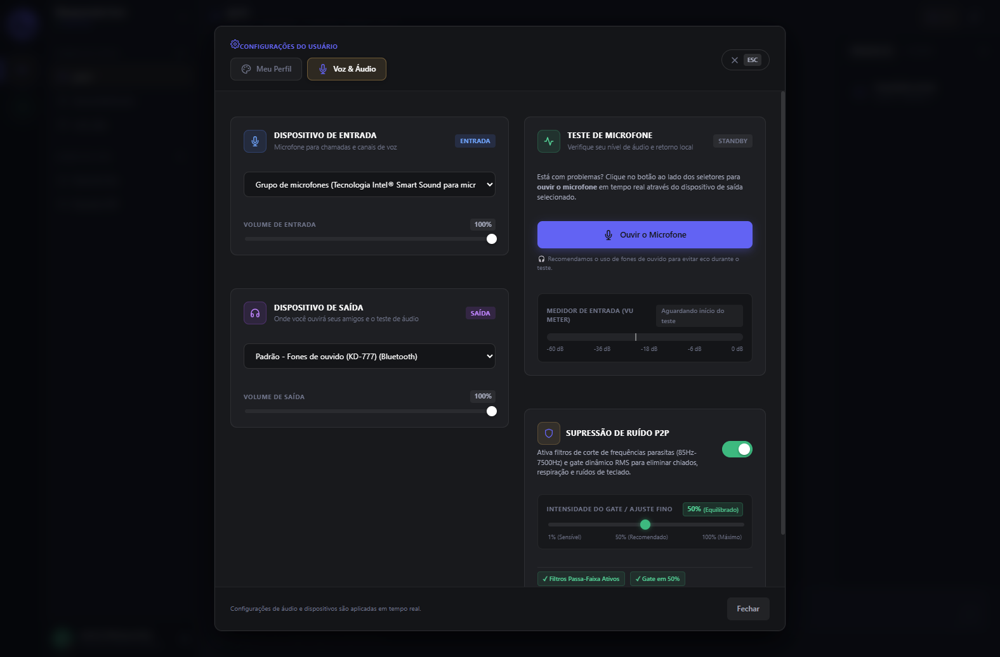
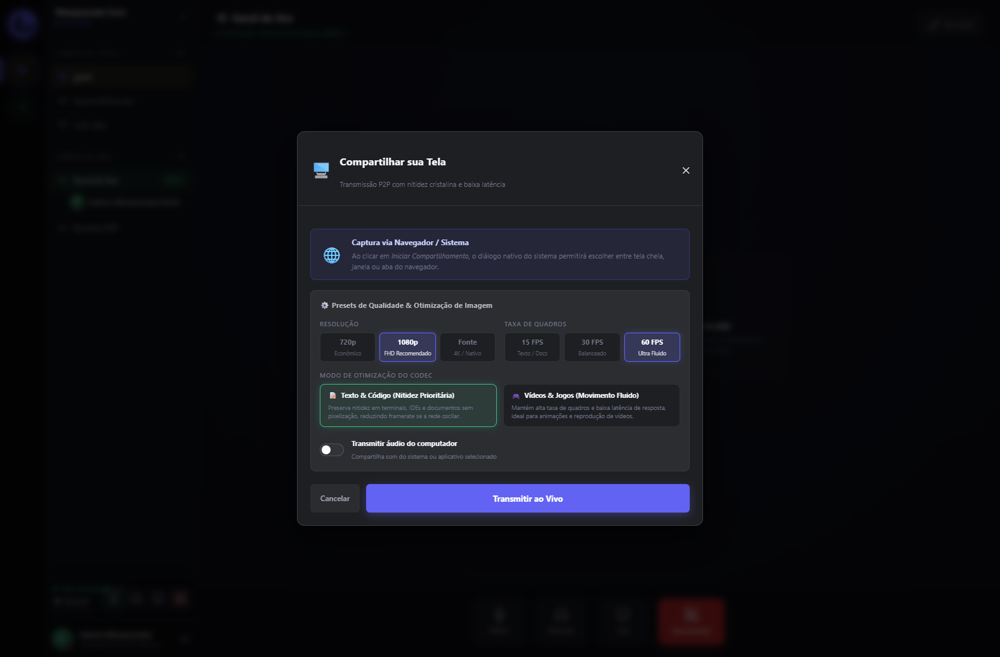
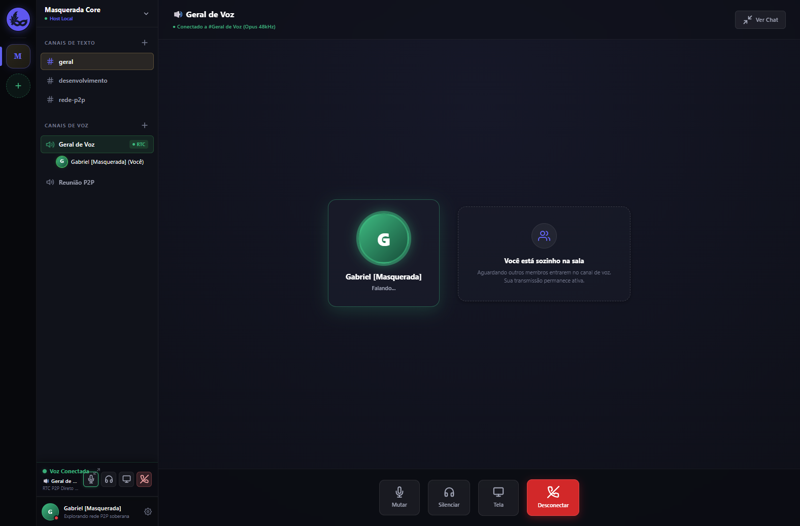

<div align="center">

# 🎭 Masquerada

### Comunicação Privada, Soberana e Descentralizada P2P
**Mensagens Criptografadas, Voz HD com Supressão de Ruído & Compartilhamento de Tela a 60 FPS**

<br/>

[](https://github.com/ryuclover/Masquerada/releases/download/v0.1.0/Masquerada-Windows-x64.zip)
[](https://www.electronjs.org/)
[](https://react.dev/)
[](https://www.typescriptlang.org/)
[](https://webrtc.org/)
[](https://www.sqlite.org/)
[](LICENSE)

<br/>

**Masquerada** é um ecossistema desktop de comunicação privada e soberana inspirado na experiência familiar de canais do Discord, mas fundamentado sobre uma **arquitetura 100% descentralizada (Local-First e Peer-to-Peer)**. Seus dados, chats, chaves criptográficas e transmissões de áudio e vídeo pertencem unicamente a você — sem servidores corporativos centrais, sem coleta de telemetria e sem mineração de dados.

<br/>

### 📥 [👉 **Clique aqui para Baixar o Pacote Portátil (.ZIP) para Windows**](https://github.com/ryuclover/Masquerada/releases/download/v0.1.0/Masquerada-Windows-x64.zip)
*(Ou acesse o [Portal Oficial de Download](https://website-sigma-three-56.vercel.app))*

<br/>

[✨ **Funcionalidades**](#-principais-funcionalidades) • [📸 **Demonstração Visual**](#-demonstração-visual-da-aplicação) • [🛡️ **Arquitetura & Segurança**](#-arquitetura--segurança-p2p) • [🚀 **Como Executar**](#-como-rodar-o-projeto-localmente) • [📦 **Exportar .EXE**](#-como-exportar-o-executável-exe-para-windows)

<br/>



</div>

---

## 💡 Por que o Masquerada foi criado?

As plataformas de comunicação em grupo tradicionais (como Discord, Slack ou Teams) exigem que cada mensagem, conversa de voz e compartilhamento de tela transite por servidores centrais corporativos. Isso introduz problemas estruturais:

1. **Vigilância e Telemetria Contínua:** Seus metadados de presença, lista de amigos, conexões e hábitos de comunicação são armazenados e catalogados indefinidamente.
2. **Ponto Único de Falha e Censura:** Quedas nos datacenters centrais paralisam comunidades inteiras, e servidores comunitários podem ser deletados arbitrariamente sem aviso.
3. **Ausência de Propriedade Real:** O histórico de conversas não fica sob controle do usuário em formato aberto; se a conta for encerrada, o histórico é perdido.

O **Masquerada** inverte essa equação:
- **Zero Servidores Centrais de Mensagens:** A comunicação ocorre via conexões criptografadas diretas P2P (Peer-to-Peer) entre pares autenticados.
- **Banco de Dados Local-First:** Todo o histórico de servidores, canais e mensagens reside localmente no seu computador em um banco SQLite veloz e auditável.
- **Voz e Vídeo em Alta Definição:** Comunicação por voz com codec Opus a 48 kHz, Noise Gate ajustável milimetricamente (1% a 100%) e compartilhamento de tela cristalino em 1080p a 60 FPS com dicas de codec para nitidez de texto ou fluidez de jogos.

---

## 📸 Demonstração Visual da Aplicação

### 1. Interface Familiar, Moderna e Descentralizada
Ambiente escuro imersivo sem elementos visuais poluentes, com servidores em abas laterais, canais de texto e voz com contagem de membros em tempo real, painel de amigos e timeline rica.

<p align="center">
  
</p>

---

### 2. Painel de Áudio Avançado & Supressão de Ruído de Precisão (1% a 100%)
Ajuste fino do Noise Gate por controle deslizante contínuo, seleção dinâmica de dispositivos de microfone e alto-falante, além de monitor de áudio em loopback com medidor VU em tempo real para testes instantâneos.

<p align="center">
  
</p>

---

### 3. Compartilhamento de Tela a 60 FPS com Otimização de Codec
Modal de captura nativa com pré-visualização de telas e janelas ativas, seleção de resolução (1080p 60 FPS ou 720p 30 FPS) e perfis de codec (`detail` para IDEs e texto nítido, `motion` para jogos e vídeos em movimento contínuo).

<p align="center">
  
</p>

---

### 4. Cinema Stage & Modo Palco Imersivo
Assista à transmissão de amigos em modo palco dedicado, com suporte a Tela Cheia (F11), PiP (Picture-in-Picture) para multitarefa, barra flutuante de controles rápidos e indicador de qualidade da transmissão em tempo real.

<p align="center">
  
</p>

---

## ⚡ Principais Funcionalidades

### 🎙️ Motor de Áudio & Voz HD
- **WebRTC Mesh com Codec Opus 48 kHz:** Áudio cristalino de baixa latência e consumo otimizado de banda.
- **Supressão de Ruído Ajustável (1% a 100%):** Noise Gate analítico baseado em decibéis (`-80 dB` a `-20 dB`) com ataque e liberação suaves para eliminar barulho de teclado mecânico e ventoinhas sem cortar a voz.
- **Monitor de Microfone em Loopback:** Teste o microfone antes de entrar em salas com retorno auditivo e visualizador VU animado.
- **Seleção Dinâmica de Dispositivos:** Troque microfones e fones de ouvido sem precisar reiniciar a aplicação.
- **Efeitos Sonoros Nativos (SFX):** Sons sintetizados diretamente via Web Audio API para entrar/sair de canais, mutar microfone e ensurdecer áudio.

### 🖥️ Compartilhamento de Tela em Alta Definição (60 FPS)
- **Captura Nativa via Electron Capturer:** Compartilhe a tela inteira ou qualquer janela individual aberta no Windows.
- **Modos de Transmissão:**
  - **1080p a 60 FPS:** Máxima fluidez para jogos e apresentações dinâmicas.
  - **720p a 30 FPS:** Modo econômico para conexões instáveis.
- **Otimização de Codec Inteligente:**
  - `contentHint: 'detail'`: Prioriza nitidez absoluta de linhas finas e caracteres para editores de código (VS Code), PDFs e terminais.
  - `contentHint: 'motion'`: Prioriza taxa de quadros e baixa latência para jogos e mídias visuais.
- **Cinema Stage:** Palco de exibição com foco no apresentador, controles flutuantes, visualização PiP e modo tela cheia.

### 💬 Canais & Comunidades Descentralizadas
- **Servidores e Canais Locais:** Crie servidores comunitários com múltiplos canais de texto e voz.
- **Isolamento de Canais:** Participantes em salas de voz diferentes nunca têm seus fluxos de áudio cruzados.
- **Barra de Voz Persistente:** Mantenha-se conectado ao canal de voz enquanto navega por chats de texto de qualquer servidor.
- **Mensagens Diretas (DMs) & Gestão de Amigos:** Adicione amigos por chave pública e inicie conversas privadas instantâneas.

### 🛡️ Arquitetura & Segurança P2P
- **Local-First com SQLite:** Mensagens e estados são gravados localmente primeiro, garantindo funcionamento offline com outbox FIFO resiliente.
- **Criptografia Ed25519 & SRTP:** Trocas autenticadas com chaves assimétricas onde apenas os participantes possuem os segredos criptográficos.
- **Fronteira IPC Segura:** Isolamento rigoroso de contexto no Electron (`contextIsolation: true`, `nodeIntegration: false`) com canais allowlisted estritos.

---

## 🛠️ Tecnologias & Ecossistema

<div align="center">

| Camada | Tecnologias Utilizadas |
| :--- | :--- |
| **Desktop Core** |    |
| **Front-end & UI** |    |
| **Tempo Real & Mídia** |    |
| **Persistência Local** |   |
| **Testes & Qualidade** |   |
| **Empacotamento** |   |

</div>

---

## 🚀 Como Rodar o Projeto Localmente

### Pré-requisitos
- [Node.js](https://nodejs.org/) versão **20.x** ou superior
- Gerenciador de pacotes `npm`

### 1. Clonar o Repositório
```bash
git clone https://github.com/ryuclover/Masquerada.git
cd Masquerada
```

### 2. Instalar as Dependências
```bash
npm install
```

### 3. Executar em Modo de Desenvolvimento
Inicia o Electron com hot-reload automático para alterações de código:
```bash
npm run dev
```

### 4. Executar Testes Automatizados & Checagem de Tipos
O projeto conta com mais de **1.600 testes unitários e de integração** cobrindo o motor de áudio, WebRTC, banco SQLite e componentes de interface:
```bash
# Executar a suíte de testes com Vitest
npm test

# Validação rigorosa de tipagem TypeScript
npm run typecheck
```

---

## 📦 Como Exportar o Executável (.EXE) para Windows

O projeto inclui um fluxo de automação completo para gerar uma versão executável portátil sem complicações.

### Opção A: Executar o Script Automatizado (Recomendado)
Basta dar um duplo clique no arquivo **`exportar-exe.bat`** na raiz do projeto (ou executá-lo no terminal):

```cmd
exportar-exe.bat
```

O script realizará automaticamente:
1. Verificação do ambiente Node.js e ferramentas de compilação.
2. Build dos bundles de produção (`npm run build`).
3. Empacotamento do binário `.exe` portátil via Electron Builder em `dist/`.

### Opção B: Via Comandos NPM
```bash
# Compilar e gerar executável portátil
npm run dist:portable

# Ou gerar instalador completo para Windows
npm run dist:win
```

O executável final pronto para uso estará disponível na pasta `dist/` (ex: `dist/Masquerada-0.1.0-setup.exe` ou versão portátil).

---

## 📂 Estrutura do Projeto

```plaintext
Masquerada/
├── docs/                       # Documentação de segurança, modelo de ameaças e capturas de tela
│   ├── screenshots/            # Imagens em alta resolução da aplicação
│   └── security/               # Baseline de segurança e Threat Model
├── scripts/                    # Scripts de suporte à exportação e sincronização de releases
│   ├── export-exe.ps1          # Script PowerShell de empacotamento
│   └── sync-website-release.js # Sincronizador de versão
├── src/
│   ├── main/                   # Processo principal do Electron (Janelas, IPC, SQLite, Capturer)
│   ├── preload/                # Script de preload com ContextBridge segura
│   └── renderer/               # Interface React 19 (Componentes, UI, Hooks, Web Audio)
│       └── src/
│           ├── components/     # Modais de tela, palco de voz, timeline de chat, amigos
│           └── voice/          # Motor WebRTC, processamento de áudio, noise gate e SFX
├── electron-builder.yml        # Configuração de empacotamento Windows (.exe portátil e setup)
├── exportar-exe.bat            # Executador em lote para Windows em 1 clique
└── package.json                # Dependências e scripts do projeto
```

---

## 📄 Licença

Distribuído sob a licença **MIT**. Consulte o arquivo [LICENSE](LICENSE) para obter mais informações sobre termos de uso e redistribuição.

---

## 👨‍💻 Autor

Desenvolvido por **Gabriel Silva** ([@ryuclover](https://github.com/ryuclover)).

- 💼 **LinkedIn:** [linkedin.com/in/gabrielmsas](https://www.linkedin.com/in/gabrielmsas/)
- 🐙 **GitHub:** [@ryuclover](https://github.com/ryuclover)
- 📖 **Portfólio & Outros Projetos:** [ryuclover/Guia-dos-meus-projetos](https://github.com/ryuclover/Guia-dos-meus-projetos)

<br/>

<div align="center">
  <sub>Construído com paixão por arquiteturas distribuídas, segurança e software livre.</sub>
</div>
